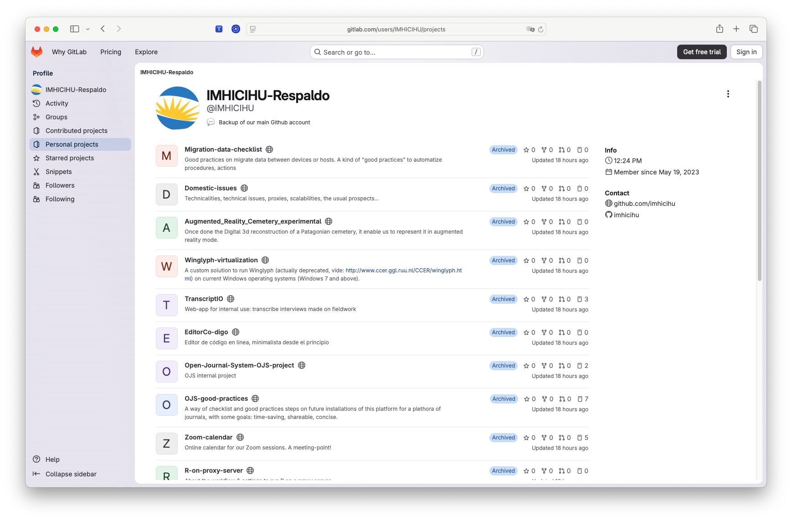

<p align="center">
  
</p>


---

## Motivación / [Rationale](README.md)
Planificar una [cuenta de respaldo](https://gitlab.com/users/IMHICIHU/projects) para los repositorios alojados en GitHub parece ser una tarea rutinaria.
s. Pero a veces esto no es lo habitual. Siguiendo ciertas reglas, un "plan B" resiliente en una época de [destrucción de datos](https://openai.com/index/hugging-face-model-evaluation-security-incident/) puede resultar eficaz.
En la medida de lo posible, se han guardado todos los metadatos junto con toda la documentación relacionada. Algunos repositorios [no son visibles](https://github.com/imhicihu/ArchWeb/blob/main/images/Screenshot_2026-07-17_at_2.20.37.png) por motivos de seguridad
Una declaración final: redundancia es una condición _sine qua non_



## [Cron](https://es.wikipedia.org/wiki/Cron_(Unix)) job

```
0 17 15 7 *
```
> “A las 17:00 horas el día 15 de julio, cada año”

### Código de conducta

* Por favor, consulta nuestro [Código de conducta](código_de_conducta.md)

### Aspectos legales ###

* Todas las marcas registradas son propiedad de sus respectivos titulares

### Licencia ###

* El contenido de este proyecto no está sujeto a ninguna [licencia](https://github.com/imhicihu/securus/blob/main/LICENSE)
