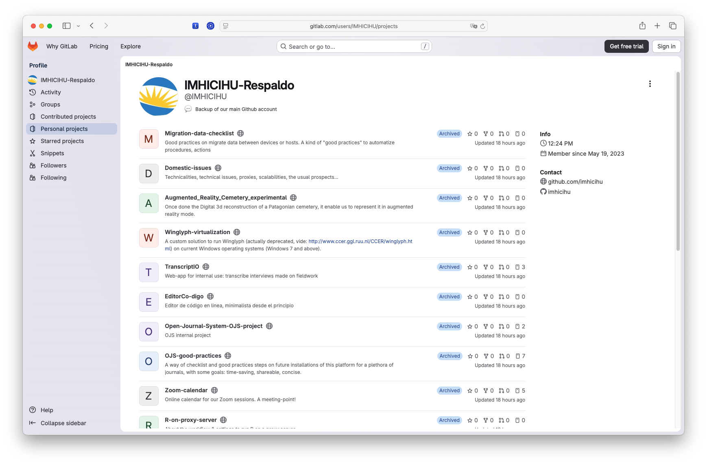

<p align="center">
  
</p>


---

## Rationale / [Motivación](LEEME.md)
Planning a [backup account](https://gitlab.com/users/IMHICIHU/projects) for repositories hosted on GitHub seems to be a regular task. 
But sometimes this is not the usual. Following certain rules, a resilient `plan b` in an age of redundant [data obliterations](https://openai.com/index/hugging-face-model-evaluation-security-incident/) can be successful.
To the extent possible, all metadata was saved along with all related documentation. By the way, some repositories are [not visible](https://github.com/imhicihu/ArchWeb/blob/main/images/Screenshot_2026-07-17_at_2.20.37.png) for security reasons
A final statement: redundancy is a _sine qua non_ condition



> <https://gitlab.com/users/IMHICIHU/projects>

### [Cron](https://en.wikipedia.org/wiki/Cron) job

---
```
0 17 15 7 * /usr/bin/python3 /home/usuario/tarea.py
```
> “_At 17:00 on day-of-month 15 in July once a year_”

---
### Plan

| Site | Repository GitHub | Backup |
|:--|:--|:--|
| [Enlaces](https://enlacesimhicihu.vercel.app/) | &#10004; | &#10004; |
| [website](https://imhicihu.conicet.gov.ar/)| &#10004; | &#10004; |
| [Calendar](https://zoom-calendar.vercel.app/)| &#10004; | &#10004; |
| [biblio-searcher](https://biblio-searcher-v2.vercel.app/)| &#10004; | &#10004; |
| [TranscriptIO](https://hablante.surge.sh/)| &#10004; | &#10004; |
| [Temas Medievales](https://temasmedievales.imhicihu-conicet.gov.ar/index.php/TemasMedievales) | No | No |
| [Status page](https://imhicihu.statuspage.io/)| &#10004; | &#10004; |


### Code of Conduct

* Please, check our [Code of Conduct](code_of_conduct.md)

### Legal

* All trademarks are the property of their respective owners

### License ###

* The content of this project itself is [unlicensed](https://github.com/imhicihu/securus/blob/main/LICENSE)
